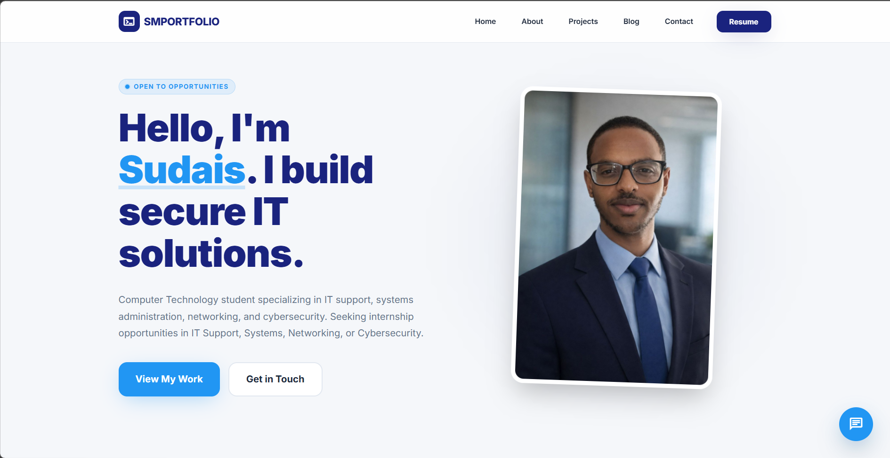

# Sudais Mohamed — Personal Portfolio

A modern, professional portfolio website showcasing skills, experience, education, and 26+ home lab projects. Built with HTML, CSS, and JavaScript featuring a premium design, NLP-powered chatbot, dynamic QR code, and downloadable resume.



---

## Live Demo

**Website:** [https://joyful-jalebi-2f13b7.netlify.app/](https://joyful-jalebi-2f13b7.netlify.app/)

**GitHub:** [https://github.com/sudais7/personal-portfolio](https://github.com/sudais7/personal-portfolio)

---

## Features

- **Premium Modern Design** — Glass-effect navigation, gradient backgrounds, smooth animations
- **Responsive Layout** — Optimized for desktop, tablet, and mobile devices
- **NLP-Powered Chatbot** — Uses Compromise.js for natural language understanding
- **26 Project Cards** — Filterable by category with pagination
- **Dynamic QR Code** — Auto-generated link to live portfolio
- **Contact Form** — Powered by Formspree with AJAX submission
- **Blog Section** — Lab write-ups and technical articles

---

## Site Sections

| Section | Description |
|---------|-------------|
| **Home** | Hero section with profile photo, animated badge, and call-to-action buttons |
| **About** | Quick facts sidebar, biography, and skill tags |
| **Projects** | 26 lab projects with category filters (Virtualization, Linux, Networking, Cybersecurity, DevOps, Web) |
| **Blog** | Technical write-ups on iptables, Hyper-V, Docker networking |
| **Contact** | Premium contact form with social media links |

---

## Chatbot

The portfolio includes an **NLP-powered chatbot** with a premium UI design.

### Features
- **Natural Language Processing** using Compromise.js
- **Intent Detection** with keyword and synonym matching
- **Quick Reply Buttons** for common questions
- **Message Timestamps** and user/bot avatars
- **Online Status Indicator**

### Topics Covered
- Technical skills (Python, Windows, Linux, networking, cybersecurity tools)
- Work experience (Python Instructor, IT Mentor, IT Team Member)
- Education (Bowie State University, Montgomery College)
- Projects and GitHub repositories
- Contact information and resume

### Usage
1. Click the glowing chat icon in the bottom-right corner
2. Use quick reply buttons or type a question
3. Press Enter or click the send button

---

## Tech Stack

| Technology | Purpose |
|------------|---------|
| **HTML5** | Semantic structure and accessibility |
| **CSS3** | Custom properties, Flexbox, Grid, animations |
| **JavaScript** | Interactivity, form handling, chatbot logic |
| **Compromise.js** | Natural language processing for chatbot |
| **Formspree** | Contact form backend |
| **Google Fonts** | Inter font family |
| **Material Symbols** | Icon library |

---

## Run Locally

1. **Clone the repository:**
   ```bash
   git clone https://github.com/sudais7/personal-portfolio.git
   cd personal-portfolio
   ```

2. **Serve the files** (any static server works):
   - **VS Code Live Server:** Right-click `index.html` → Open with Live Server
   - **Python:** `python -m http.server 8000` then open http://localhost:8000
   - **Node:** `npx serve` or `npx live-server`

3. Open in browser at `http://localhost:8000`

---

## Project Structure

```
personal-portfolio/
├── index.html          # Main portfolio page
├── blog.html           # Blog listing page
├── styles.css          # Premium design system
├── script.js           # Navigation, form, projects filter
├── chatbot.js          # NLP chatbot logic
├── blog/
│   ├── iptables-lab.html
│   ├── hyperv-templates.html
│   └── docker-networking.html
├── assets/
│   ├── images/
│   │   ├── image.png              # Profile photo
│   │   └── portfolio_screenshot.png
│   └── resume/
│       └── resume.pdf
└── README.md
```

---

## Configuration

| Item | Instructions |
|------|--------------|
| **Contact Form** | Form is pre-configured with Formspree endpoint |
| **Projects** | Edit project cards in `index.html` to add/modify projects |
| **Resume** | Replace `assets/resume/resume.pdf` with your resume |
| **Profile Photo** | Replace `assets/images/image.png` with your photo |

---

## QR Code

The footer QR code dynamically links to the live portfolio URL. Visitors can scan it to quickly access or share the site.

---

## License

© Sudais Mohamed. All rights reserved.
